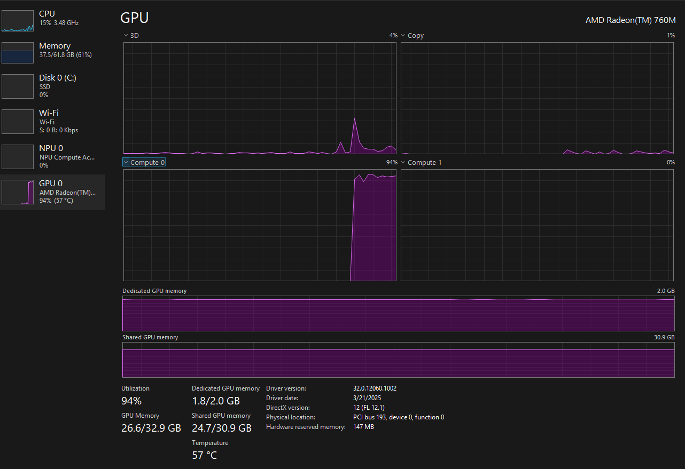

Repo to document my process of running Qwen3-Coder locally to replace claude code since opus won't be on pro anymore really.

CPU: AMD Ryzen 5 7640U (12) @ 4.95 GHz
GPU: AMD Radeon(TM) 760M (1.86 GiB) [Integrated]
Memory: 37.43 GiB / 61.81 GiB (61%)

 Internal Gpu has shared memory with the system memory - 30.9 gb.

Currently running the latest qwen3-coder-30b-a3b-instruct@q6_k with 48/48 model layers offloaded to the gpu. 1024 Evaluation batch.
Currently running well with a 12228 max context length.

Somehow, this little laptop gpu runs better than my nvidia 2060 - primarily because it has so much internal memory. I'd have to get another 3090 with 24gb or something to get even clsoe to this in terms of loading models.
It's generation speed is perfectly fine for chat applications, when using local qwen code cli with 

`
OPENAI_API_KEY=dummy_key
OPENAI_BASE_URL=http://192.168.8.186:1234/v1
OPENAI_MODEL=qwen3-coder-30b-a3b-instruct@q6_k
`

in a .env it does take a while and I still haven't gotten the local tools working.
